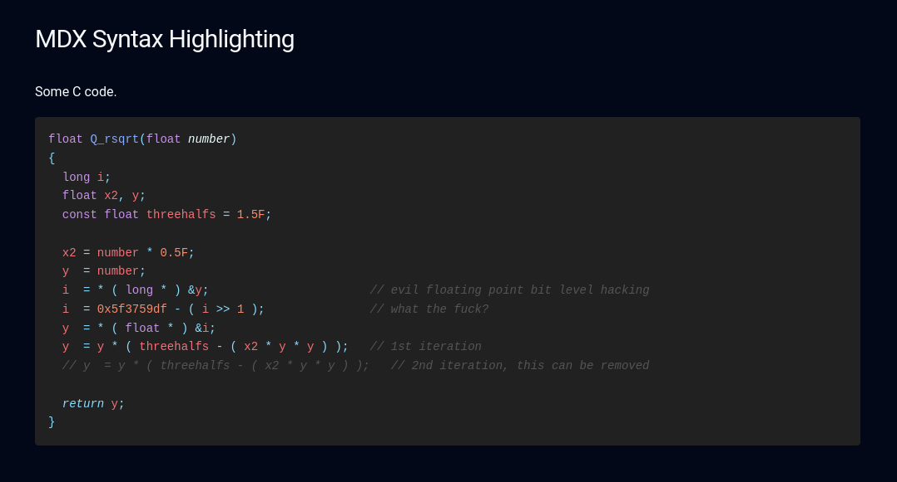

This is an example Next.js project that uses [Shiki](https://shiki.style/) to render code blocks with syntax highlighting.
It uses [next-mdx-remote](https://github.com/hashicorp/next-mdx-remote) to render MDX content.



Preview: https://nextjs-shiki-syntax-highlight.vercel.app/

## Getting Started

First, run the development server:

```bash
npm run dev
```

Open [http://localhost:3000](http://localhost:3000) with your browser to see the result.

You can start editing the page by modifying `app/page.tsx`. The page auto-updates as you edit the file.

## Overview

A rehype plugin for syntax highlighting is located at`lib/mdx/syntax-highlight`.
It uses custom "code meta" format, which is just JSON, to pass additional information to the plugin.
It supports showing line numbers, highlighting lines, and displaying a filename inside the code block (`MdxCodeBlock`).

This is a good starting point to create your own highlighting environment.
